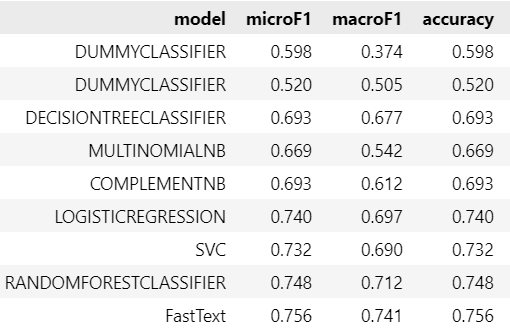

# Objectivity_Prediction_Web_App
 A ML web app which detect objectivity of the text and analyzes the sentiment based on the VADER lexicon.

I built a classifier model which detects whether a text is subjective or objective, based on the genre-annotated dataset GINCO, machine-translated to English (MT-GINCO).

I first prepare the data (see *1-Data-Preparation.ipynb*), then I perform machine learning experiments with different models to assess which model is the most suitable for the task (see *2-Sci-Kit-Experiments.ipynb* and *3-FastText-Experiments.ipynb*). Then I deploy the best performing models with Flask - to see the final results, run the script *models-and-flask-app/Flask-structure-explained.py* in your terminal (python models-and-flask-app/Flask-structure-explained.py).

The results of ML experiments:

The best performing models are Logistic Regression, SVM, Random Forest Classifier and the FastText model.

(This work was based on the tutorial here: https://towardsdatascience.com/how-to-easily-build-your-first-machine-learning-web-app-in-python-c3d6c0f0a01c)
